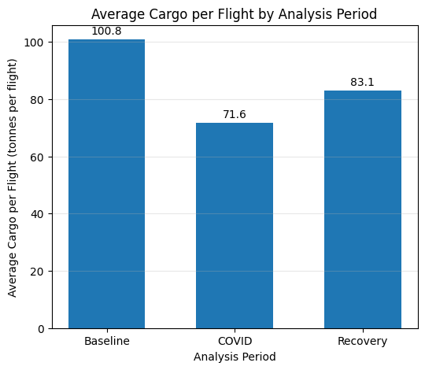
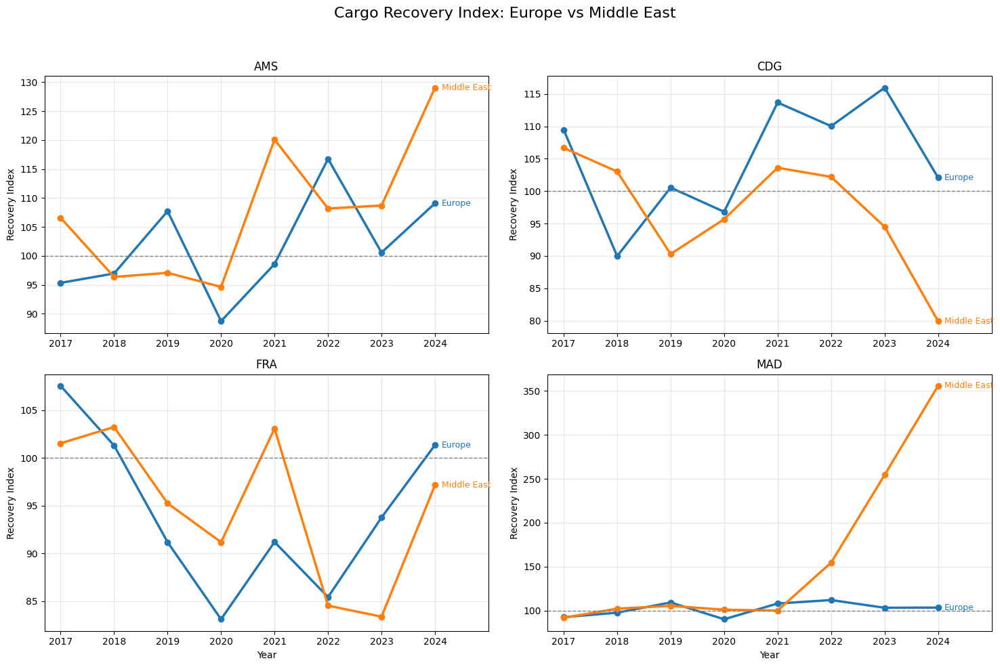
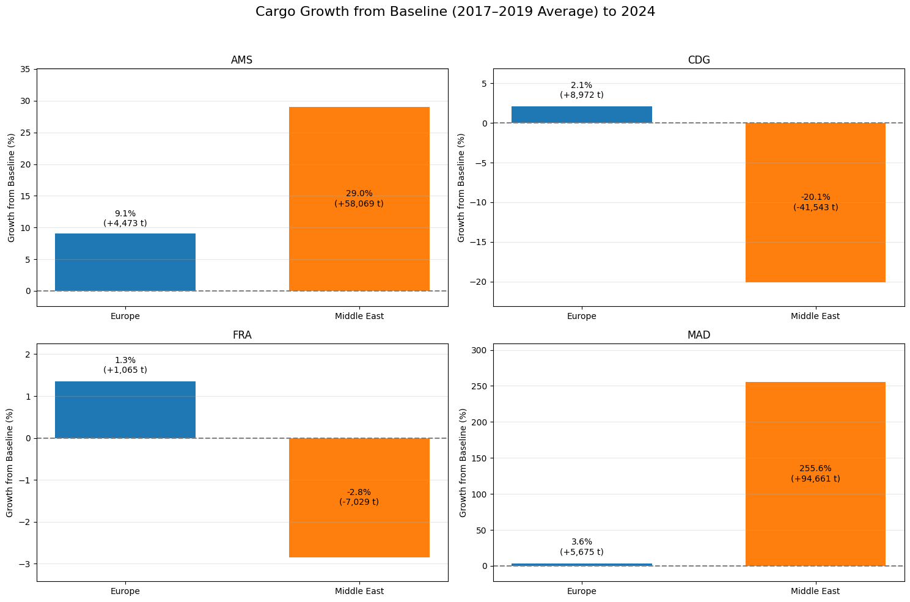
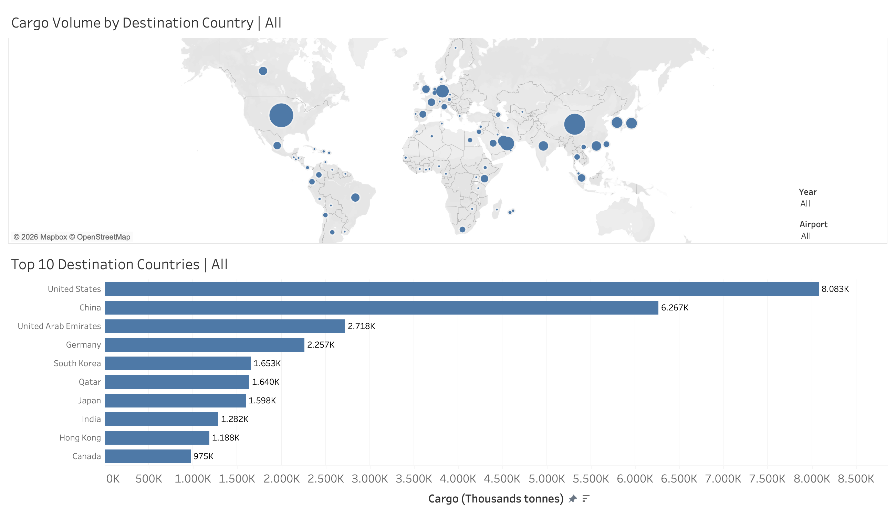
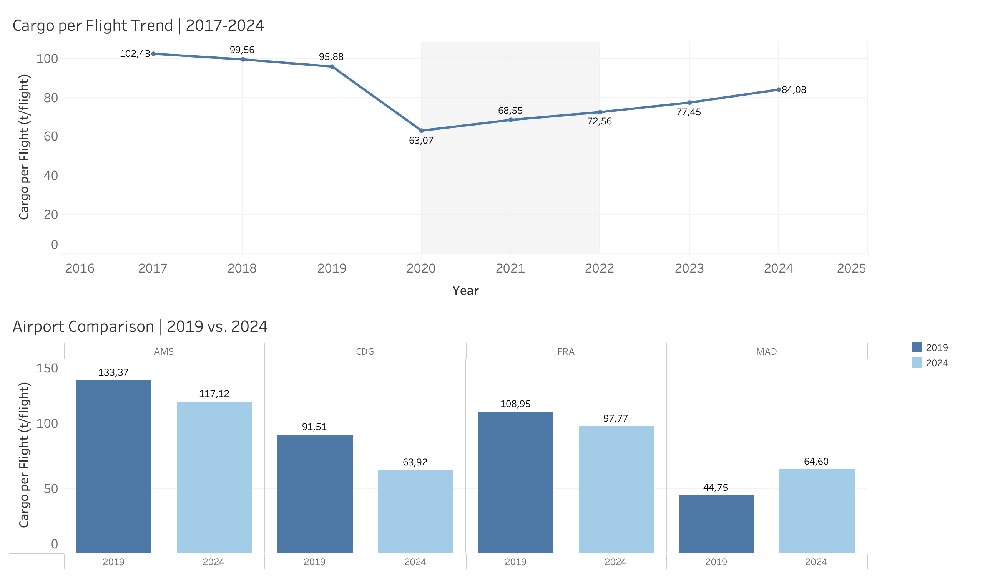

# Back in the Air — European Aviation Recovery After COVID-19

An end-to-end data analytics project exploring how passenger traffic, cargo transport, and flight operations recovered after the COVID-19 pandemic across four major European hub airports using official Eurostat data (2017–2024).

---

## Project Overview

The COVID-19 pandemic caused an unprecedented disruption to global aviation. In 2020, passenger traffic at Europe's major hubs collapsed by over 70% almost overnight — a drop with no historical precedent. Cargo operations told a very different story: considerably more resilient, they continued to play a critical role in maintaining global supply chains throughout the crisis.

This project investigates how both passenger and cargo traffic evolved between 2017 and 2024 at four of Europe's busiest hub airports:

- **AMS** — Amsterdam Schiphol
- **CDG** — Paris Charles de Gaulle
- **FRA** — Frankfurt Airport
- **MAD** — Adolfo Suárez Madrid-Barajas

Using statistical hypothesis testing and interactive Tableau dashboards, we compare pre-pandemic, pandemic, and recovery periods to identify what really happened — and why the recovery looked so different depending on where you landed.

---

## Research Questions

The project tests four hypotheses across both passenger and cargo data:

### H1 — Recovery Speed
*Did Amsterdam recover more slowly than the other hub airports by 2022?*

We expected AMS to lag behind — but the data told a different story.

### H2 — Operational Efficiency
*Did transport efficiency (passengers or cargo per flight) recover after COVID?*

Load factors collapsed during the pandemic. We investigated whether airlines came back leaner — or whether efficiency simply returned to where it was.

### H3 — COVID Impact
*Did passenger and cargo traffic decrease by more than 50% during the first pandemic year?*

The scale of the 2020 collapse is well documented in headlines. We tested whether the numbers held up statistically.

### H4 — Regional Shift
*Did post-pandemic aviation networks shift toward new destinations and regions, particularly toward the Middle East?*

Gulf carriers expanded aggressively during the recovery. We tested whether that translated into a measurable structural shift.

---

## Key Results

### H1 — Recovery Speed: ❌ Rejected
Frankfurt (FRA), not Amsterdam, was the slowest to recover. By 2022, FRA had reached only 75% of its pre-COVID passenger levels — the lowest of all four hubs — held back by its heavy dependence on business travel, which recovered far more slowly than leisure. Madrid (MAD) led the recovery at 92%, driven by Spain's tourism rebound. By 2024, MAD was the only airport to exceed its own pre-COVID baseline, finishing +4% above its historical average.

For cargo, H1 is also rejected: recovery patterns differed across airports but did not confirm AMS as the slowest.
Paris (CDG) exhibited the slowest recovery by 2022, reaching a recovery index of 87.3%, followed closely by Amsterdam (AMS) at 88.7%. Frankfurt (FRA) recovered to 96.6% of its pre-COVID baseline, while Madrid (MAD) exceeded its baseline with a recovery index of 108.2%.

### H2 — Operational Efficiency: ✅ Confirmed (passengers) | ⚠️ Partial (cargo)
Passenger efficiency — measured as passengers per flight — dropped sharply in 2020 (between −38% and −43% across hubs) as airlines operated with very low load factors. By 2023, efficiency had not only recovered but exceeded pre-COVID levels at all four airports, with MAD leading at +10.4% above baseline. This was confirmed as statistically significant (p = 0.002), suggesting a genuine structural improvement driven by route optimisation and a focus on high-demand destinations.

For cargo, average cargo per flight declined gradually between 2017 and 2019, followed by a pronounced drop in 2020. From 2021 onwards, cargo efficiency (cargo per flight) recovered steadily, although the 2019 level had not yet been fully reached by 2024, resulting in a partial confirmation only.

### H3 — COVID Impact: ✅ Confirmed (passengers) | ❌ Not confirmed (cargo)
Passenger traffic fell by an average of 71.5% across all four hubs in 2020, well exceeding the 50% threshold. Frankfurt was hit hardest at −74.2%, Paris the least at −69.4%. The drop was confirmed statistically significant (p ≈ 0), with the sharpest decline in April 2020 following the imposition of European travel restrictions.

Cargo traffic proved substantially more resilient. In 2020, declines ranged from 10.7% at FRA to 25.8% at MAD, with none of the four airports reaching the hypothesised 50% threshold.

### H4 — Regional Shift: ⚠️ Partially confirmed (both)
Middle East routes from European hubs showed stronger growth than European routes in 2022 and 2023, consistent with the expansion of Gulf carriers and hub airports. However, by 2024 European routes had caught up, with both regions performing comparably above pre-COVID baseline levels. The Middle East advantage was real but temporary — not the structural shift we originally hypothesised.

For cargo, H4 was only partially supported. Middle East cargo grew substantially faster at AMS and especially MAD, but declined at CDG and FRA, indicating airport-specific rather than uniform regional growth. Although median Middle East cargo volumes were higher during the recovery period, the difference was statistically significant only for FRA (p = 0.030).

---

## Data Pipeline

The project follows a Python-first analytics workflow. PostgreSQL serves purely as a serving layer to connect the finished dataset to Tableau — all cleaning, transformation, and statistical analysis was performed upstream in pandas.

```
Eurostat (Excel)
      ↓
Python / pandas
      ↓
Data Cleaning + EDA + Statistical Testing (Mann-Whitney U)
      ↓
PostgreSQL (via SQLAlchemy)
      ↓
Tableau Dashboards
```

### Workflow Steps

1. **Extract** — Download official Eurostat aviation datasets as Excel files.
2. **Import** — Load raw files into pandas.
3. **Clean** — Handle nulls, standardise airport and route codes, correct data types.
4. **Analyse** — Run exploratory data analysis, classify routes (Survivors / Lost / New / COVID-only), and conduct Mann-Whitney U hypothesis tests after confirming non-normality via Shapiro-Wilk.
5. **Load** — Write processed datasets to PostgreSQL via SQLAlchemy.
6. **Connect** — Establish PostgreSQL → Tableau live connection.
7. **Visualise** — Build interactive dashboards and a Tableau Story for presentation.

---

## Insights

### H1 — Why did Frankfurt lag so far behind?
Frankfurt's slower recovery is not a coincidence — it is a structural story. FRA is Europe's most business-travel-oriented hub, and business travel was the last segment to return post-COVID. Remote work normalised during the pandemic, corporate travel budgets were cut, and companies discovered that a significant share of their flights could be replaced by video calls. Lufthansa's post-COVID restructuring also reduced capacity at its home hub. Madrid, by contrast, is a leisure-first airport serving one of Europe's most tourism-dependent economies. When pent-up demand exploded in 2022 and 2023, MAD was perfectly positioned to capture it — and by 2024 it was the only hub in our study to exceed its own pre-COVID baseline. The lesson: not all airports are equal, and the type of traffic they serve matters as much as their size.


### H2 — Efficiency improved, not just recovered
The efficiency story is perhaps the most surprising finding of the project. We expected efficiency to recover — what we did not expect was for it to structurally exceed pre-COVID levels. Airlines emerged from the pandemic leaner: unprofitable routes were cut, schedules were consolidated around high-demand destinations, and load factors improved as a result. This is visible in the data — by 2023, all four hubs were operating above their pre-COVID passengers-per-flight baseline, with Madrid again leading at +10.4%. The zero-passenger flights recorded during 2020 are worth noting: these were aircraft repositioning and repatriation operations, not the ghost flights often reported in the press — the EU temporarily waived its slot-use rules precisely to prevent that.



### H3 — Two pandemics in one: passengers vs cargo
The 71.5% passenger collapse and the roughly 25% cargo decline are not just different numbers — they reflect two fundamentally different market dynamics playing out simultaneously. Passenger travel stopped because governments closed borders and people stopped flying. Cargo continued because supply chains could not stop: medical equipment, PPE, e-commerce volumes, and perishable goods still needed to move. In some periods, cargo was actually loaded onto passenger aircraft with seats removed — a practice that became widespread in 2020. This divergence is one of the clearest illustrations of why analysing passenger and cargo traffic separately gives a far more complete picture of what COVID actually did to aviation.


### H4 — The Middle East surge: real, but temporary
The expansion of Gulf carriers — Emirates, Qatar Airways, Etihad — during the post-COVID period was genuine and well documented. Their hub airports invested heavily during the pandemic, their fleets were younger, and they were able to restart operations faster than European legacy carriers burdened with restructuring costs. This gave them a measurable edge in 2022 and 2023. But by 2024 European routes had caught up, suggesting the advantage was one of timing rather than structure. The Middle East did not permanently capture market share from Europe — it got there first, and Europe followed.




---

## Data Sources

All data comes from **Eurostat**, the statistical office of the European Union, covering 2017–2024 (on a monthly bases per year and route). The passengers analysis uses the **passengers carried** metric at the route (origin–destination) level. This metric was chosen deliberately to avoid double-counting connecting travellers, given the route-level structure of the dataset.

Datasets used:
- Passenger traffic
- Passenger Flight movements
- Cargo traffic
- Cargo Flight movements

---

## Dashboards & Visualisation

The final results are presented through a Tableau Story of five dashboards plus a conclusions slide. Passenger dashboards were built by Natalia Ströher; cargo dashboards by Hendrik Albrecht.

---

### Dashboard 1 — Passenger Traffic per Airport
*Owner: Natalia Ströher*

The entry point into the passenger analysis. A line chart shows total annual passengers at each of the four hub airports from 2017 to 2024, with a reference line marking the pre-COVID average across all hubs (48.3M). A dropdown allows switching the baseline between the cross-hub average and each airport's own pre-COVID average — making it possible to assess recovery on each airport's own terms rather than against a shared benchmark.

Below the line chart, a bar chart breaks down passenger volumes by period (Pre-COVID / COVID / Post-COVID) and airport, showing the percentage change versus the selected baseline. This is where the per-airport recovery story becomes clearest: Madrid is the only hub to exceed its own pre-COVID baseline by 2024, while Frankfurt remains the furthest below.

**Technical highlights:**
- Per-airport pre-COVID baselines built using `FIXED [Airport IATA Code]` LOD expressions
- Parameter-driven baseline toggle (own avg vs. across-hubs avg)
- Click-to-highlight interaction on the airport legend


---

### Dashboard 2 — Growth by Region
*Owner: Natalia Ströher*

Zooms out from the four hubs to the global picture. A year-over-year growth line chart tracks how passenger volumes evolved across all world regions from 2017 to 2024, with a shaded COVID band and an annotation marking where Europe overtook the Middle East in 2024.

A horizontal bar chart below shows total passengers (or flights, switchable via radio button) by subregion. This chart adapts dynamically based on the region selected in the filter above, allowing drill-down from global region to subregion in a single interaction.

**Technical highlights:**
- Region filter drives both charts simultaneously via a shared parameter
- Passengers / Flights toggle built as a calculated field driven by a parameter
- COVID period reference band as a fixed annotation layer


---

### Dashboard 3 — Cargo Geography
*Owner: Hendrik Albrecht*

A geographic map showing the distribution of cargo routes across the four hub airports, with dot size and colour encoding cargo volume. Also included is an overview of the 
Top 10 Destinations from 2017 - 2024.

**Technical highlights:**
- Year and airport filters update both visualizations simultaneously




---

### Dashboard 4 — Cargo per Flight (Efficiency)
*Owner: Hendrik Albrecht*

Tracks cargo per flight across the four hubs from 2017 to 2024. After a sharp decline in 2020, the overall average recovered steadily but remained below its pre-COVID level in 2024. AMS, CDG, and FRA had not fully recovered, while MAD was the only airport to exceed its 2019 level.

**Technical highlights:**
- Cargo per flight calculated as total cargo divided by total flights.
- COVID period highlighted with a reference band.
- Combined trend and airport-level comparison in one dashboard.



---

### Dashboard 5 — Conclusions
*Owner: both*

A summary slide presenting the hypothesis results side by side for passengers and cargo, using confirmed / rejected / partial icons. Designed to be read in under thirty seconds — one line per hypothesis, two columns for passenger vs cargo outcome.


---

> **Note on screenshots:** To add screenshots, export each dashboard from Tableau (Dashboard → Export as Image) and save to the `presentation/` folder using the filenames above. GitHub renders them inline automatically.

---

## Technologies

| Tool | Purpose |
|---|---|
| Python / pandas | Data cleaning, EDA, statistical testing |
| NumPy / SciPy | Statistical tests (Shapiro-Wilk, Mann-Whitney U) |
| SQLAlchemy | Loading processed data into PostgreSQL |
| PostgreSQL | Serving layer for Tableau |
| Tableau Desktop | Interactive dashboards and final presentation |

matplotlib 🗺️: For word cloud visualizations.
Pandas 🐼: For data processing.
Python 🐍: For the backend and for data manipulation.
Tableau 📈: For interactive data visualizations.

---

## Repository Structure

```
.
├── data/              # Raw Eurostat datasets
├── python/            # Cleaning, EDA and statistical analysis notebooks
├── src/               # Reusable Python functions
├── sql/               # Database schema and load scripts
├── tableau/           # Tableau workbooks and dashboards
├── presentation/      # Final presentation slides
└── README.md
```

---

## Getting Started

### Requirements

- Python 3.x
- PostgreSQL
- Tableau Desktop

Python dependencies are imported at the top of each notebook. A running PostgreSQL instance and Tableau Desktop are required to execute the full pipeline.

To explore the analysis without running the pipeline, the `presentation/` folder contains screenshots of all dashboards and key matplotlib plots from the notebooks.

---

## Authors

**Natalia Ströher**
**Hendrik Albrecht**

Capstone Project — Data Analytics Bootcamp

---

## Acknowledgements

Data provided by **Eurostat**, the statistical office of the European Union.

---

## License

This project was developed as part of a Data Analytics Bootcamp Capstone Project.